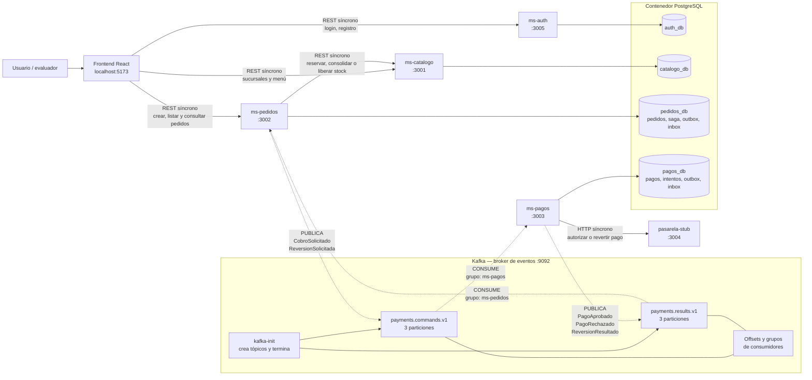

# C4 — Arquitectura completa

```mermaid
flowchart LR
    USER["Usuario / evaluador"]
    FE["Frontend React<br/>localhost:5173"]

    AUTH["ms-auth<br/>:3005"]
    CAT["ms-catalogo<br/>:3001"]
    PED["ms-pedidos<br/>:3002"]
    PAY["ms-pagos<br/>:3003"]
    STUB["pasarela-stub<br/>:3004"]

    USER --> FE

    FE -->|"REST síncrono<br/>login, registro"| AUTH
    FE -->|"REST síncrono<br/>sucursales y menú"| CAT
    FE -->|"REST síncrono<br/>crear, listar y consultar pedidos"| PED

    PED -->|"REST síncrono<br/>reservar, consolidar o liberar stock"| CAT
    PAY -->|"HTTP síncrono<br/>autorizar o revertir pago"| STUB

    subgraph KAFKA["Kafka — broker de eventos :9092"]
        INIT["kafka-init<br/>crea tópicos y termina"]
        COMMANDS["payments.commands.v1<br/>3 particiones"]
        RESULTS["payments.results.v1<br/>3 particiones"]
        META["Offsets y grupos<br/>de consumidores"]

        INIT --> COMMANDS
        INIT --> RESULTS
        COMMANDS --- META
        RESULTS --- META
    end

    PED -.->|"PUBLICA<br/>CobroSolicitado<br/>ReversionSolicitada"| COMMANDS
    COMMANDS -.->|"CONSUME<br/>grupo: ms-pagos"| PAY

    PAY -.->|"PUBLICA<br/>PagoAprobado<br/>PagoRechazado<br/>ReversionResultado"| RESULTS
    RESULTS -.->|"CONSUME<br/>grupo: ms-pedidos"| PED

    subgraph POSTGRES["Contenedor PostgreSQL"]
        AUTHDB[("auth_db")]
        CATDB[("catalogo_db")]
        PEDDB[("pedidos_db<br/>pedidos, saga, outbox, inbox")]
        PAYDB[("pagos_db<br/>pagos, intentos, outbox, inbox")]
    end

    AUTH --> AUTHDB
    CAT --> CATDB
    PED --> PEDDB
    PAY --> PAYDB
```

Las flechas continuas son operaciones síncronas. Las flechas punteadas representan comunicación asíncrona mediante Kafka.
